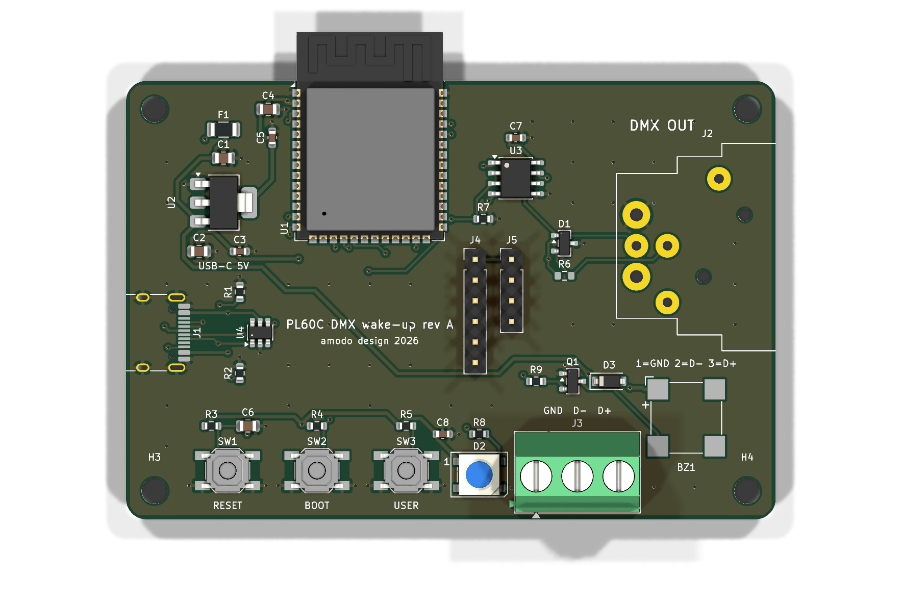
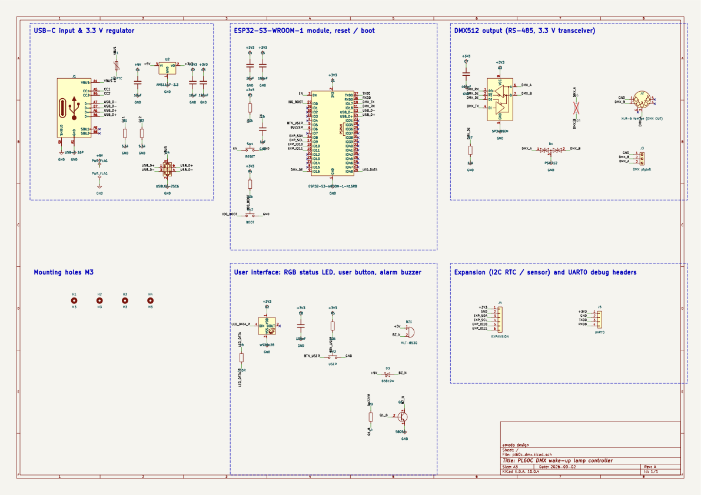
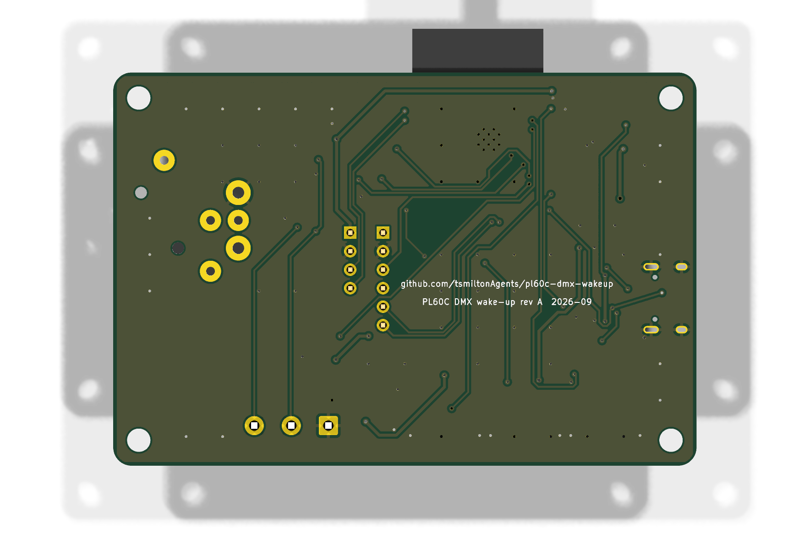
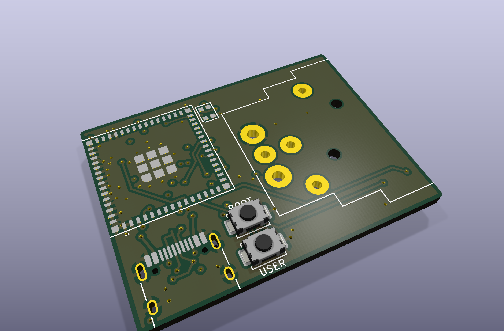
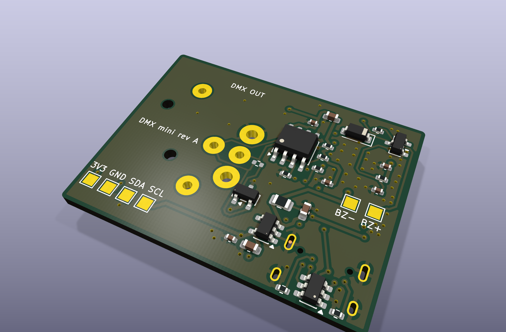

# PL60C DMX wake-up lamp controller

A small ESP32-S3 board that drives the wired DMX512 input of a **Neewer PL60C** panel light so the
light can be ramped up slowly in the morning (sunrise alarm). Rev A, 2026-09-02.

Everything in this repository is generated by scripts (`./build.sh`): schematic, PCB, autorouting,
design-rule checks, Gerbers, and the JLCPCB BOM / pick-and-place files. The design passes KiCad ERC and
DRC with zero errors, the schematic and PCB netlists are cross-checked against the single source of
truth (`hw/design.py`), and every part number has been verified in stock on LCSC/JLCPCB.

| | |
|---|---|
| Board | 80 x 54 mm, 2 layers, 1.6 mm FR-4, all parts on the top side |
| MCU | ESP32-S3-WROOM-1-N16R8 (Wi-Fi + BLE, native USB) |
| DMX out | 5-pin XLR female (Neutrik NC5FAH) **and** a 3-way screw terminal for a pigtail |
| Power | USB-C, 5 V, 1 A resettable fuse, 3.3 V LDO |
| UI | RESET, BOOT, USER buttons, WS2812B RGB status LED, magnetic buzzer (alarm fallback) |
| Extras | I2C/GPIO expansion header (RTC, light sensor), UART0 header |
| Files to order | `production/pl60c_dmx_gerbers.zip`, `production/pl60c_dmx_bom_jlcpcb.csv`, `production/pl60c_dmx_cpl_jlcpcb.csv` |
| Mini variant | 38.5 x 29 mm, 4 layers, both sides, same circuit and pin map: see section 8 and `production_mini/` |



Status: **designed and verified in software, not yet manufactured or bench-tested.** Read the
"Before you order" section.

---

## 1. How the light is controlled

### 1.1 The PL60C's DMX port (verified from Neewer's manual and DMX chart)

* Connectors on the bottom edge of the lamp head: `DMX-IN` = **5-pin XLR male** panel socket,
  `DMX-OUT` = 5-pin XLR female (pass-through for daisy-chaining).
* Pinout: pin 1 = signal common (0 V), pin 2 = Data−, pin 3 = Data+, pins 4 and 5 unused.
* Enable DMX on the light: long-press MODE/MENU, set `DMX ON/OFF` = ON, then `DMX ADDR` (001–512, default 1).
* On loss of the DMX signal the light **holds the last look** (no timeout). The controller must therefore
  keep streaming frames; when you want the light off, send intensity 0 rather than stopping the stream.
* No RDM support is documented. The port is not documented as isolated.

This board is the DMX **transmitter**, so it has a 5-pin XLR **female** socket (ANSI E1.11 convention).
A normal 5-pin DMX cable (male–female) goes from this board to the light's `DMX-IN`.

### 1.2 PL60C channel map (one fixed personality)

Channel numbers are relative to the DMX start address `n` set on the light. Channel `n` selects the mode,
`n+1` is always intensity, the rest depend on the mode. The FX mode uses up to 9 channels, so treat the
light as a 9-channel fixture.

| ch n value | Mode | n+1 | n+2 | n+3 | n+4 … n+8 |
|---|---|---|---|---|---|
| 0–31 | **CCT** | Intensity 0–100 % | Colour temperature 2500–10000 K | G/M −50…+50 | – |
| 32–63 | HSI | Intensity | Hue 0–360° | Saturation 0–100 % | – |
| 64–95 | FX | Intensity | Effect select | effect parameters | effect parameters |
| 96–127 | GEL | Intensity | Gel brand | Gel index | – |
| 128–159 | RGBCW | Intensity | Red | Green | Blue, Cool white, Warm white |
| 160–191 | XY | Intensity | x | y | – |

For a sunrise, CCT mode is the natural choice: ramp `n+1` from 0 to the target and, if you like, sweep
`n+2` from warm (2500 K) towards neutral as the intensity rises. Sources are listed at the end.

### 1.3 DMX512 on the wire

DMX512 is EIA-485 at 250 kbit/s, 8 data bits, no parity, 2 stop bits. A frame is: BREAK (≥ 92 µs, use
176 µs) → MARK-AFTER-BREAK (≥ 12 µs) → start code 0x00 → up to 512 slot bytes, then repeat at roughly
40–44 Hz. Data+ (pin 3) is the RS-485 **A** line, Data− (pin 2) is **B**, pin 1 is the common. A 120 Ω
terminator belongs only at the far end of the cable (the last fixture), never at the transmitter.

---

## 2. Hardware design



Full-size PDF: `production/pl60c_dmx_schematic.pdf`.

### 2.1 Blocks

**USB-C input and 3.3 V rail.** 16-pin USB-C receptacle (HRO TYPE-C-31-M-12) with 5.1 kΩ CC pull-downs
so any USB-C charger or host supplies 5 V. A 1 A hold / 1.8 A trip PTC (F1) protects the board, a
USBLC6-2SC6 (U4) clamps ESD on D+/D−/VBUS, and an AMS1117-3.3 (U2, 1 A) makes 3.3 V with 10 µF on both
sides. Budget: ESP32-S3 Wi-Fi peaks ≈ 0.5 A, buzzer ≈ 0.1 A average, LED < 60 mA.

**ESP32-S3-WROOM-1-N16R8 (U1).** 16 MB flash, 8 MB PSRAM, on-module PCB antenna. The antenna end of the
module hangs 6 mm past the top board edge, which is Espressif's preferred placement (no copper anywhere
near the antenna). USB D+/D− go straight to GPIO20/GPIO19: the S3's built-in USB-Serial/JTAG gives
programming, console and debugging with no bridge chip. EN has the standard 10 kΩ + 1 µF reset delay and
the RESET button; GPIO0 has a 10 kΩ pull-up and the BOOT button (hold BOOT, tap RESET to force the
ROM downloader, or just use `esptool` over USB which does it automatically).

**DMX transmitter (U3, SP3485EN).** 3.3 V RS-485 half-duplex transceiver, pin-compatible with MAX3485.
DI ← GPIO17 (UART TX), RO → GPIO18 (UART RX), DE and /RE tied together to GPIO16 with a 10 kΩ pull-down,
so the line is only driven once firmware asserts DE (keeps the bus quiet during boot/flash). A → XLR
pin 3 (Data+), B → XLR pin 2 (Data−), XLR pin 1 → GND. A PSM712 asymmetric TVS array (D1, +12 V / −7 V,
the RS-485 standard part) clamps surges on both lines. R6 (120 Ω) is fitted **only** if you ever want this
board to terminate a line; it is marked DNP and JLCPCB will not place it. The same three signals are on
screw terminal J3 (GND, D−, D+) so you can wire a cable pigtail instead of using the XLR.

**User interface.** WS2812B RGB LED (D2) on GPIO48 through 330 Ω, powered from 3.3 V exactly like the
ESP32-S3-DevKitC-1 (out of the datasheet's 3.5 V minimum but proven in Espressif's own reference
design; if you prefer strict spec, the DevKit's approach is still what nearly every S3 board ships).
USER button on GPIO5 with a 10 kΩ pull-up (snooze / manual on). Magnetic buzzer BZ1 (MLT-8530,
passive, 2.7 kHz resonant) driven by an S8050 NPN (Q1) from GPIO6 via 1 kΩ, with a B5819W Schottky
flyback diode (D3) across the coil, for an audible alarm fallback.

**Expansion.** J4: 3V3, GND, GPIO8 (SDA), GPIO9 (SCL), GPIO10, GPIO11 (e.g. a DS3231 RTC or an ambient
light sensor). J5: 3V3, GND, GPIO43 (TXD0), GPIO44 (RXD0). Four M3 mounting holes.

### 2.2 Pin map (also in `firmware/pins.h`)

| Function | GPIO | Notes |
|---|---|---|
| DMX TX (SP3485 DI) | 17 | UART1 TX |
| DMX RX (SP3485 RO) | 18 | UART1 RX, only for RDM/monitoring |
| DMX DE / /RE | 16 | HIGH = transmit; 10 kΩ pull-down |
| USB D− / D+ | 19 / 20 | native USB-Serial/JTAG |
| BOOT button | 0 | active low, strapping pin |
| USER button | 5 | active low, 10 kΩ pull-up |
| WS2812B data | 48 | 330 Ω series, LED at 3.3 V |
| Buzzer | 6 | NPN low-side switch, PWM 2.7 kHz |
| I2C SDA / SCL | 8 / 9 | header J4 |
| Spare | 10 / 11 | header J4 |
| UART0 TX / RX | 43 / 44 | header J5 |

Unused module pins are left unconnected. GPIO35–37 are reserved by the octal PSRAM of the R8 module
and GPIO3/45/46 are strapping pins; none of them is used.

### 2.3 Layout



USB-C on the left edge, XLR on the right edge with its flange over the board edge, buttons and the LED
along the bottom edge for an enclosure front panel, the terminal block also on the bottom edge.
Ground pours on both layers with stitching vias, 0.25 mm signal tracks, 0.4 mm power tracks,
0.15 mm clearance, 0.7 / 0.35 mm vias: all comfortably inside JLCPCB's 2-layer capability.
The USB-C data-pair escape is hand-routed (the router cannot do the D+/D− pair swap at 0.5 mm pitch);
the rest is autorouted by Freerouting and then checked by KiCad DRC.

---

## 3. Firmware guidance (no firmware is included, by design)

The hardware was designed so that the standard **[esp_dmx](https://github.com/someweisguy/esp_dmx)**
library works unmodified: `dmx_set_pin(DMX_NUM_1, PIN_DMX_TX, PIN_DMX_RX, PIN_DMX_DE)` and then
`dmx_write()` + `dmx_send()` at 40–44 Hz. It handles the break/MAB timing with the UART hardware.

Suggested behaviour:

1. Boot, connect to Wi-Fi, sync time by SNTP (add a DS3231 on J4 if you want time without Wi-Fi).
2. Stream a DMX frame continuously (44 Hz). Idle: `ch1 = 0` (CCT mode), `ch2 = 0` (intensity 0).
   Never stop the stream: the PL60C holds the last look on signal loss.
3. Sunrise: over 20–30 min raise `ch2` from 0 → target with a perceptual (gamma ≈ 2.2) curve, optionally
   sweep `ch3` from 2500 K towards 4000–5600 K. After the ramp hold, then optionally sound the buzzer
   (2.7 kHz square wave on GPIO6, 50 % duty, short beeps) until USER is pressed.
4. USER button: short press = snooze / cancel, long press = manual light toggle. BOOT can be a second
   button after boot. RGB LED: breathing colours for state (idle / ramping / alarm / no Wi-Fi).
5. Set the light's `DMX ADDR` to 1 so the controller's channels 1–9 map directly.

Provisioning, OTA and a web UI are the usual ESP-IDF / Arduino-ESP32 fare; the S3's USB CDC console is
available on the USB-C port without any extra hardware.

---

## 4. Ordering from JLCPCB

Files in `production/`:

| File | Purpose |
|---|---|
| `pl60c_dmx_gerbers.zip` | Gerber RS-274X (Protel extensions) + Excellon drills, JLCPCB settings |
| `pl60c_dmx_bom_jlcpcb.csv` | BOM in JLCPCB format (Comment, Designator, Footprint, LCSC Part #) |
| `pl60c_dmx_cpl_jlcpcb.csv` | Pick-and-place, rotations corrected with the JLCKicadTools database |
| `pl60c_dmx_cpl_kicad_rotation.csv` | Same, with raw KiCad rotations, in case the preview shows parts turned |
| `pl60c_dmx_bom_full.csv` | Engineering BOM incl. DNP and mechanical parts |
| `pl60c_dmx_schematic.pdf`, `pl60c_dmx_pcb_top.pdf`, `pl60c_dmx_pcb_bottom.pdf`, `pl60c_dmx.step` | documentation / mechanical |

Steps:

1. jlcpcb.com → *Order now* → upload `pl60c_dmx_gerbers.zip`. Options: 2 layers, 80 x 54 mm, 1.6 mm,
   any colour, HASL (lead-free) or ENIG, 1 oz copper, "Remove order number: specify location" is not
   needed (no marker placed; choose "Yes" if you dislike the number).
2. Turn on **PCB Assembly**, top side, then upload `pl60c_dmx_bom_jlcpcb.csv` and
   `pl60c_dmx_cpl_jlcpcb.csv`.
3. In the parts step all 25 BOM lines resolve to the LCSC numbers below. R6 is intentionally absent (DNP).
4. **Check the placement preview carefully** for rotation of U2 (SOT-223), U3 (SOIC-8), D1/Q1 (SOT-23),
   J1 (USB-C), D2 (WS2812B), J2 (XLR) and J3 (terminal). JLCPCB's orientation conventions differ from
   KiCad's per package; if any polarised part looks turned, re-upload
   `pl60c_dmx_cpl_kicad_rotation.csv` or rotate it in their editor. Pin 1 of the module is the
   top-left pad when the antenna points up.
5. Through-hole parts (XLR, terminal block, headers) are "extended" parts assembled by hand at JLCPCB;
   they add a small per-part fee. If you prefer, delete J2/J3/J4/J5 from the BOM and solder them yourself.

### 4.1 Bill of materials (all verified in stock on LCSC on 2026-09-02, `tools/check_lcsc.py`)

| Ref | Part | LCSC | JLC type |
|---|---|---|---|
| U1 | ESP32-S3-WROOM-1-N16R8 | C2913202 | extended |
| U2 | AMS1117-3.3, SOT-223 | C6186 | basic |
| U3 | SP3485EN-L/TR, SOIC-8 | C8963 | basic |
| U4 | USBLC6-2SC6, SOT-23-6 | C7519 | extended |
| D1 | PSM712-LF-T7 TVS, SOT-23 | C32677 | basic |
| D2 | WS2812B-B/T 5050 | C2761795 | extended |
| D3 | B5819W Schottky, SOD-123 | C8598 | basic |
| Q1 | S8050 NPN, SOT-23 | C2146 | basic |
| F1 | PTC 1 A hold, 1206 | C5358568 | extended |
| J1 | USB-C 16P, HRO TYPE-C-31-M-12 | C165948 | extended |
| J2 | Neutrik NC5FAH XLR-5 female, PCB horizontal | C368501 | extended (low stock, ~130) |
| J3 | KF128-5.08-3P screw terminal | C474953 | extended |
| J4 / J5 | 2.54 mm headers 1x6 / 1x4 | C37208 / C124378 | extended |
| SW1–SW3 | TS-1187A-B-A-B tactile 5.1 mm | C318884 | basic |
| BZ1 | MLT-8530 magnetic buzzer | C94599 | extended |
| C1, C2, C4 | 10 µF 25 V 0805 | C15850 | basic |
| C6 | 1 µF 50 V 0805 | C28323 | basic |
| C3, C5, C7, C8 | 100 nF 50 V 0603 | C14663 | basic |
| R1, R2 | 5.1 kΩ 0603 | C23186 | basic |
| R3, R4, R5, R7 | 10 kΩ 0603 | C25804 | basic |
| R8 | 330 Ω 0603 | C23138 | basic |
| R9 | 1 kΩ 0603 | C21190 | basic |
| R6 | 120 Ω 0603, **DNP** | C22787 | – |

If the NC5FAH is out of stock: CAX **XLR-5M-24WP** (C53431204, same NC5FAH footprint, female despite the
name) or order the Neutrik separately and hand-solder it. Rough parts cost per board is about USD 15
(ESP32 ≈ 5, XLR ≈ 6), plus JLCPCB's PCB and assembly fees.

### 4.2 Before you order

* This is a rev A that has only been verified by simulation-free checks (ERC, DRC, netlist, Gerber
  review, part stock). The circuit follows Espressif's and the transceiver vendor's reference designs
  closely, but a first build should be treated as a prototype.
* The DMX port is **not galvanically isolated** (same as most hobby DMX interfaces). The PL60C runs from
  its own 19.6 V PSU; keep the controller on a separate USB supply and you have a normal
  ground-referenced link, which is how the light's own wired console connection works. An isolated
  variant (ADM2483 + B0505S) would add ~USD 7 and a second transceiver footprint; not done in rev A.
* USB-C receptacle mechanical: the connector body is placed with its front lip 0.55 mm proud of the
  board edge, per the HRO drawing. Check it against your enclosure.

---

## 5. Hooking it up

1. Flash firmware over the USB-C port (native USB, no driver hassle on macOS/Linux).
2. Cable: 5-pin XLR male → female DMX cable from this board's `DMX OUT` to the light's `DMX-IN`.
   Or wire a cable to J3: `GND` → XLR pin 1, `D−` → pin 2, `D+` → pin 3.
3. On the light: `DMX ON`, `DMX ADDR = 001`.
4. If the light is the only fixture and the cable is longer than a few metres, fit a 120 Ω terminator
   plug in the light's `DMX-OUT`. Do not fit R6 on this board.

---

## 6. What was verified

| Check | Result |
|---|---|
| KiCad ERC on the generated schematic | 0 findings |
| Schematic netlist vs `hw/design.py` | 27/27 nets identical |
| PCB pad-to-net vs `hw/design.py` | 27/27 nets identical |
| KiCad DRC (clearance 0.15 mm, edge 0.3 mm, hole-to-hole 0.5 mm, courtyards, silkscreen) | 0 errors; 6 warnings, all "silkscreen clipped by board edge" from the three connectors that deliberately overhang the edge |
| Unrouted connections | 0 |
| Gerbers rendered independently with gerbv (copper, silk, mask, paste, outline, drills) | match the KiCad board, see `docs/gerber_*_check.png` |
| Drill file | 151 plated + 8 non-plated holes, smallest 0.30 mm (module thermal vias enlarged from the library's 0.2 mm to suit JLCPCB) |
| LCSC stock / package for every part number | all in stock, packages match footprints (`tools/check_lcsc.py`) |
| Datasheets checked against footprints | TS-1187A vs Alps SKQG land pattern, MLT-8530 pad layout, KF128 pin size (holes set to 1.4 mm), NC5FAH (KiCad footprint is for this exact part) |

---

## 7. Repository layout and regenerating

```
hw/design.py        single source of truth: parts, LCSC numbers, nets, schematic and PCB placement
hw/design_mini.py   the MINI variant (same circuit, different parts/placement); hw/variant.py selects it
hw/gen_sch.py       KiCad 10 schematic writer (labels + power symbols, ERC-clean)
hw/gen_pcb.py       pcbnew script: board outline, footprints, nets, rules, pours, GND stitching, USB escape
hw/route.py         Freerouting driver (DSN export, autoroute, SES import, zone fill)
hw/fix_gnd.py       post-route ground fixer + dangling via cleanup
tools/export.py     Gerbers/drill, JLCPCB BOM + CPL, PDFs, renders, STEP
tools/verify_*.py   netlist consistency checks
tools/check_lcsc.py live stock check of every LCSC part number
pcb/                the generated KiCad project (open pl60c_dmx.kicad_pro in KiCad 10)
production/         everything JLCPCB needs
docs/               images used in this README
firmware/pins.h     pin map and DMX constants for the firmware author
build.sh            full pipeline; autocommit.sh commits and pushes every 2 minutes
```

Regenerate with `./build.sh` (rev A) or `./build.sh mini`. Requirements: KiCad 10.0.x app bundle at `/Applications/KiCad`
(its bundled Python is used for `pcbnew`), Java 25+ (`brew install openjdk`) and
`tools/freerouting.jar` (Freerouting 2.3.0, download from its GitHub releases), plus `gerbv` if you want
the Gerber check images. Edit `hw/design.py`, never the KiCad files (they are overwritten).

---

## 8. MINI variant (38.5 x 29 mm, 4 layers, both sides)



Same circuit, same GPIO map, one quarter of the area (1120 mm² vs 4320 mm²). Files: `production_mini/`
(`pl60c_dmx_mini_gerbers.zip`, `pl60c_dmx_mini_bom_jlcpcb.csv`, `pl60c_dmx_mini_cpl_jlcpcb.csv`),
KiCad project `pcb/pl60c_dmx_mini.*`, source `hw/design_mini.py`, build with `./build.sh mini`.

What changed to get there:

| | rev A | mini |
|---|---|---|
| Module | ESP32-S3-WROOM-1-N16R8 (18 x 25.5 mm) | **ESP32-S3-MINI-1-N8** (15.4 x 20.5 mm, C2913206), antenna off the left edge |
| Layers / sides | 2 layers, top only | **4 layers** (JLC04161H-7628 stack: signal, solid GND plane, signal + GND pour, signal), parts on **both sides** |
| XLR-5 female | on board | **on board** (Neutrik NC5FAH, right edge; its flange holes mount the board) |
| Passives | 0603 / 0805 | **0402** (all JLCPCB Basic), 10 µF in 0603 |
| LDO | AMS1117 SOT-223 | **AP2112K-3.3** SOT-23-5, 600 mA (C51118) |
| RGB LED | WS2812B 5050 | **WS2812B-2020** (C52917434) |
| Buttons | RESET, BOOT, USER (5.1 mm) | **BOOT, USER** (3.9 x 3 mm TS-1088, Basic); reset = re-plug USB or EN via the 10 k/1 µF network |
| Buzzer | on board | **off board**: driver kept (S8050 + flyback), solder a passive magnetic buzzer to the `BZ+`/`BZ-` pads |
| Pigtail terminal, headers, mounting holes | yes | dropped; I2C expansion on 4 test pads (`3V3 GND SDA SCL`), UART0 not brought out (USB console) |
| PTC | 1 A 1206 | 0.75 A 0805 (C7472571) |

Top side: module, USB-C, XLR, two buttons, RGB LED. Bottom side: everything else. The USB-C body
protrudes 0.55 mm from the bottom edge, the XLR flange protrudes from the right edge, and the module
antenna hangs 4.5 mm off the left edge, so the enclosure needs cut-outs on three sides.



Verification, same procedure as rev A: ERC 0 findings, schematic and PCB netlists identical to the design
(23 nets), 0 unrouted, DRC 0 errors (6 "silkscreen clipped by edge" warnings from the overhanging parts
and one dangling stub warning inside the hand-routed USB escape), Gerbers for all four copper layers
rendered and checked with gerbv (`docs/mini_gerber_*_check.png`), every LCSC part in stock
(`PL60C_VARIANT=mini python3 tools/check_lcsc.py`). JLCPCB rules used: 0.1 mm min track/clearance
(4-layer capability is 0.09 mm), 0.3 mm min via drill, 0.5 mm hole-to-hole, vias in the module's
centre ground pads as in Espressif's reference layout.

JLCPCB ordering differences: choose **4 layers**, and **both-side assembly** (higher setup fee) or, to save
money, top-side assembly only and hand-solder the bottom (0402s are fiddly; not recommended).
The KiCad library has no 3D model for the MINI-1 module, so it is missing from the renders (its land
pattern is the 15.4 x 20.5 mm outline top-left). `pl60c_dmx_mini_cpl_jlcpcb.csv` marks bottom parts as
`Bottom`; JLCPCB mirrors bottom-side X automatically, check their preview.

## Sources

* Neewer PL60C manual (menu, DMX pinout, hold-on-loss): https://www.manua.ls/neewer/pl60c/manual
* Neewer PL60C official DMX channel table (PDF): https://usdb.oss-us-west-1.aliyuncs.com/neewer_support/instruction/PL60C%20摄影灯DMX列表-en.pdf
* Connector photos (Amazon listing B0CJY2WXMP), Showsync / Enttec forum threads on the PL60C profile
* ANSI E1.11 DMX512-A timing; SP3485, PSM712, AMS1117, ESP32-S3-WROOM-1 datasheets; Espressif ESP32-S3-DevKitC-1 schematic
